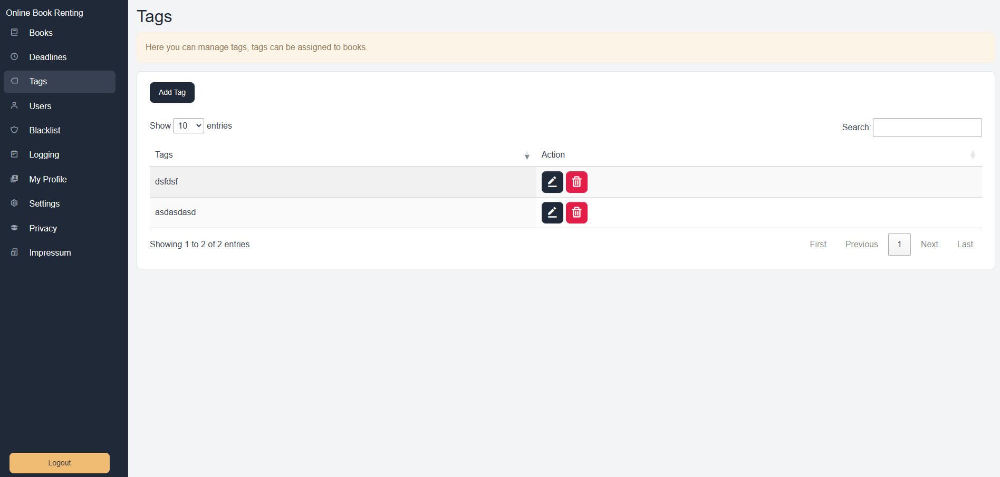
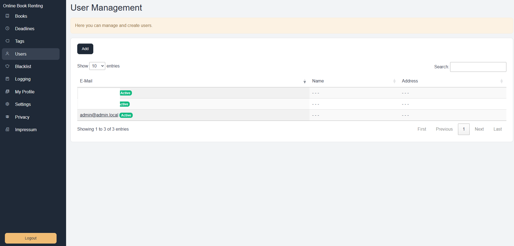

# Online Book Renting (OBR)

## Introduction 

Welcome to the Online Book Renting (OBR) Web Software documentation. OBR is a comprehensive platform for managing and renting books online. The software provides a seamless experience for both administrators and users, offering various features to manage books, rentals, users, and more.

## Screenshots

  
  
  

## Book Management

- Manage books with detailed information.
- Display books on a public page for users to view and rent.
- Manage book quantities and stock.
- ISBN numbers are consistent across quantities; each individual book has a unique barcode.

## Book Renting Management

- Rent books to users and associate books with user accounts.
- No online booking system — users must visit your location to borrow books. Simple Management system for simple Book Renting Procedures.
- Record rental transactions, including return dates, notes, and deposit information.

## User and Permission Management

- Permission based access control.
- Guests (non-logged-in users) can view and list all books.

## ISBN API Connections

- Automatically fetch book details using ISBN API when adding new books.

## Multi-Language Support

- Add new language files and set default language in the interface.
- Support for per-user language settings.
